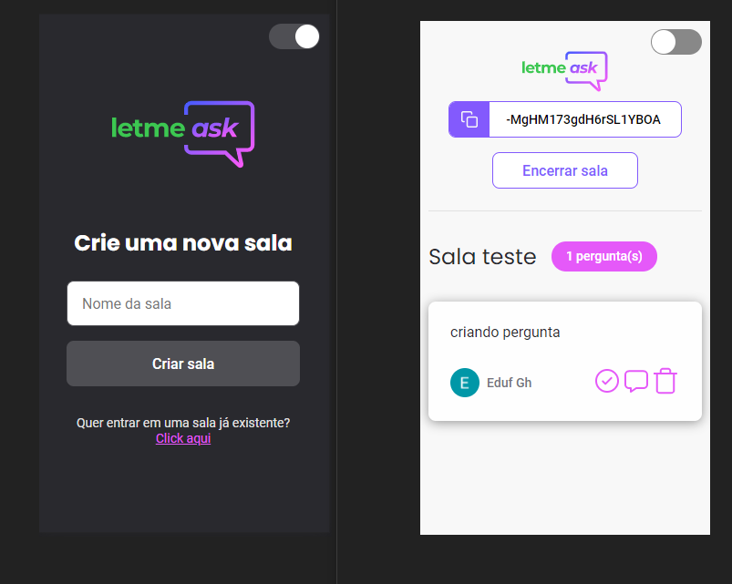

# Letmeask nlw6



[Repositório da rocketseat com o projeto original.](https://github.com/rocketseat-education/nlw-06-reactjs)

---

# Adições feitas no projeto.

- [x] styled-components.

- [x] Estrutura de pasta diferente.

- [x] Controle de autenticação, nas rotas privadas.

- [x] Tema global.

- [x] Switch linght/dark.

- [x] Hook, para salvar o estado do tema escolhido, e gravar no `localStorage`.

- [x] Responsividade.

---

# Firebase

Será necessário criar uma conta no Firebase e um projeto para disponibilizar um `Realtime Database`.

Regra de negócios.

```json
{
  "rules": {
    "rooms": {
      ".read": false,
      ".write": "auth != null",
      "$roomId": {
        ".read": true,
        ".write": "auth != null && (!data.exists() || data.child('authorId').val() == auth.id)",
        "questions": {
          ".read": true,
          ".write": "auth != null && (!data.exists() || data.parent().child('authorId').val() == auth.id)",
          "likes": {
            ".read": true,
            ".write": "auth != null && (!data.exists() || data.child('authorId').val() == auth.id)"
          }
        }
      }
    }
  }
}
```
